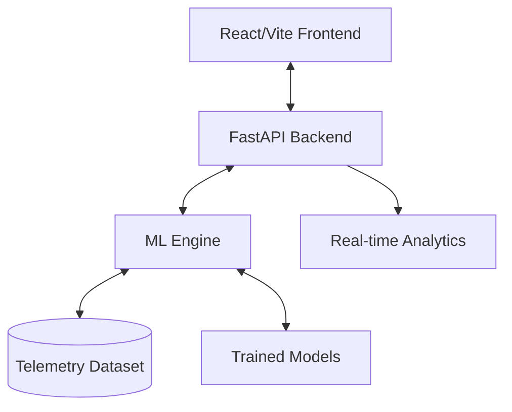

# EcoRetain: Predictive Maintenance AI Dashboard

EcoRetain is a high-performance, industrial-grade Predictive Maintenance (PdM) platform. It leverages Machine Learning to monitor machine health, predict potential failures before they occur, and optimize maintenance schedules for industrial assets.

## 🏗️ System Architecture

The project follows a modern full-stack architecture with a dedicated AI/ML pipeline:

### 1. Frontend (The "Mission Control")
- **Framework**: React.js with Vite for ultra-fast performance.
- **UI/UX**: Minimalist industrial aesthetic with "Green AI" accents.
- **Visualizations**: 
  - `Recharts` for interactive telemetry graphs.
  - `Lottie` for smooth, high-end AI status animations.
  - Responsive tables for fleet management.
- **Key Modules**:
  - `Dashboard.jsx`: Overview of fleet health and KPI metrics.
  - `Predictor.jsx`: Real-time AI inference tool for manual telemetry input.
  - `SmartMaintenance.jsx`: Logic-driven maintenance scheduling based on risk scores.
  - `Alerts.jsx`: Critical incidence monitoring.

### 2. Backend (The "API Layer")
- **Framework**: FastAPI (Python) chosen for its speed and native support for ML libraries.
- **Data Handling**: Uses `Pandas` for real-time dataset synchronization and manipulation.
- **Endpoints**:
  - `/api/predict`: Handles AI inference using the trained model.
  - `/api/machines`: Aggregates machine status and risk levels.
  - `/api/stats`: Calculates fleet-wide performance metrics.
  - `/api/telemetry/{id}`: Provides historical sensor data for specific machines.

### 3. Machine Learning (The "Neural Engine")
- **Model Type**: A 3-Way Classification model (Random Forest/XGBoost) trained using `Scikit-Learn`.
- **Feature Set**:
  - `Volt`: Voltage stability.
  - `Rotate`: Rotational speed (RPM).
  - `Pressure`: Internal fluid/air pressure.
  - `Vibration`: Structural vibration analysis.
- **Risk Tiers**:
  - **Optimal (Safe Zone)**: Baseline operating conditions.
  - **Warning (Moderate)**: Early signs of anomaly detection.
  - **Danger (High Risk)**: High probability of imminent failure.
- **Explainability (XAI)**: Features are ranked by importance to tell users *why* a machine is at risk.

## 📁 Project Structure

- `frontend/`: React source code, components, and design system.
- `backend/`: FastAPI application (`main.py`) and API logic.
- `ml/`: 
  - `data/`: CSV datasets used for training and simulation.
  - `models/`: Serialized trained models (`model.pkl`).
  - `train_final_equal.py`: ML training pipeline scripts.

## 🚀 Core Value Proposition
- **Minimizing Downtime**: Predicts failures before they cause production halts.
- **Optimizing Maintenance**: Moves from "Reactive" to "Proactive" scheduled maintenance.
- **Eco-Efficiency**: Reduces waste by extending asset life and preventing catastrophic failure.
